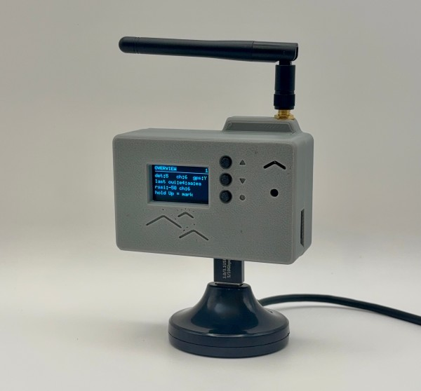

  

# Hardware and Enclosures

## Overview

This repo contains printables, PCB, schematics, BOMs, and other information needed to build Birdoscope devices. Assets are organized in folders by category, and will be kept in sync with the birdoscope-firmware repo (or noted where known stale).

Hardware sales recoup development costs and fund research, so all assets are released under CC-BY-NC-4.0. Please use, make, build, and remix however you want for any non-commercial purpose, but you may not use them commercially.

  

Birdoscope AYZr0.1 Enclosure

## STL

Printable enclosures and accessories for different Birdoscope models. Organized by matching PCB, select the appropriate model and hardware revision.

## PCB

Renders, schematics, and diagrams for different Birdoscope models. Organized by model and revision number.

## Parts

Purchase lists and BOMs needed to build and assemble different Birdoscope models. Organized by matching PCB, select the appropriate model and hardware revision.

## License

Copyright (c) 2026 Lone Crow Design.

The design files in this repository are licensed under
[CC BY-NC 4.0](https://creativecommons.org/licenses/by-nc/4.0/)
(`CC-BY-NC-4.0`). You may build, modify, and share them for noncommercial
purposes with attribution. Selling them, or products made from them, is not
permitted.

Commercial licenses are available: contact dev@lonecrowdesign.com